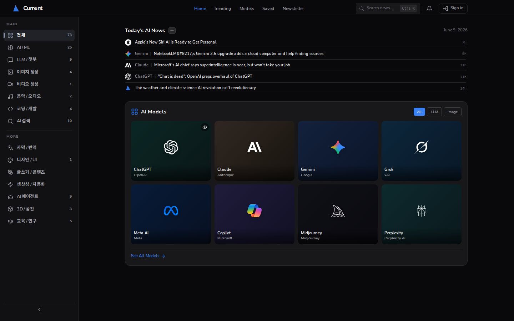
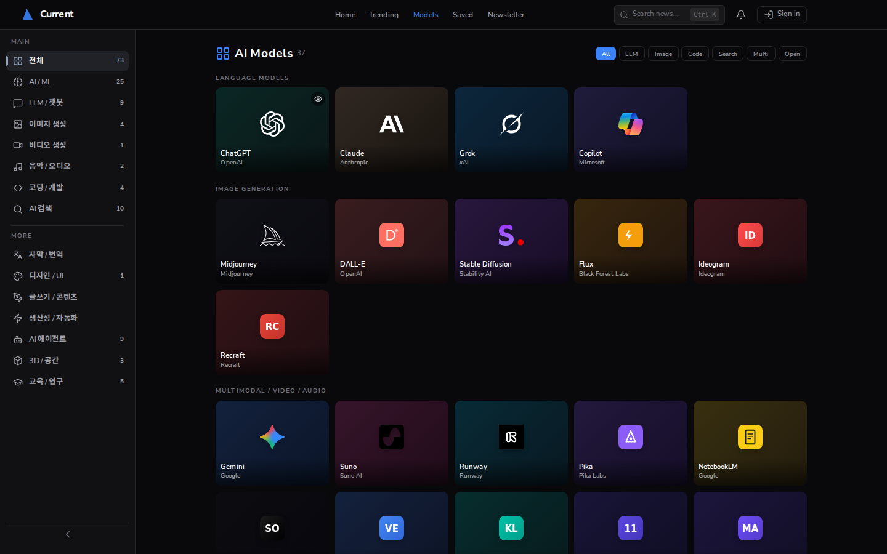
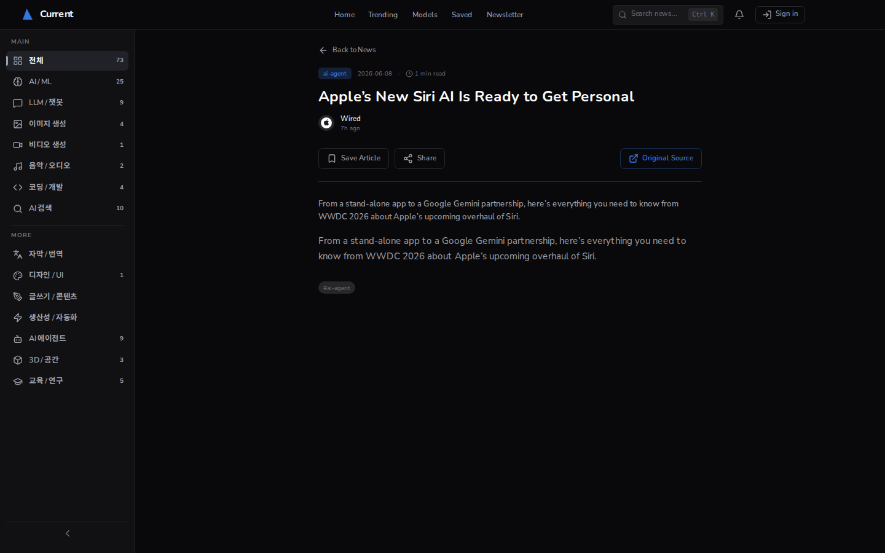

<!-- PROJECT BANNER -->
<!-- TODO: 배너 이미지를 만들면 아래 주석을 풀어 표시 (권장 1280×320, 상어 지느러미 + "Current" 로고)
  
-->
<div align="center">
  <h1>🌊 Current <sub>by Jyos</sub></h1>

  <p>
    <b>외국 AI 모델 뉴스를 자동 수집·요약해 카드형 UI로 보여주고,</b><br/>
    <b>원하는 모델의 뉴스·주가를 ESP32 하드웨어 디스플레이로 받아보는 서비스</b>
  </p>

  <!-- BADGES -->
  <p>
    
    
    
    
    
    
  </p>

  <p>
    <a href="https://current-rho.vercel.app/"><b>🔗 Live Demo</b></a>
    &nbsp;·&nbsp;
    <a href="#-시작하기"><b>🚀 시작하기</b></a>
    &nbsp;·&nbsp;
    <a href="#-로드맵"><b>🗺 로드맵</b></a>
  </p>
</div>

---

## 📖 소개

**Current**는 빠르게 쏟아지는 AI 기술 뉴스를 한곳에 모아 보여주는 **뉴스 큐레이션 플랫폼**입니다.
Claude, ChatGPT, Gemini 등 주요 AI 모델 관련 기사를 RSS로 자동 수집하고, **Claude API**로
분류·요약한 뒤 카드형 UI로 깔끔하게 정리합니다.

나아가 사용자가 관심 있는 모델을 **별표(즐겨찾기)** 해두면, 그 모델의 헤드라인과 관련 기업 주가를
**ESP32 + TFT 하드웨어 디스플레이**로 받아보는 것을 목표로 합니다. (소프트웨어 + 전용 하드웨어 결합)

> 💡 컴퓨터공학부 졸업 프로젝트(9개월) — 실서비스 론칭 및 수익화를 목표로 1인 개발 중입니다.

<br/>

<!-- SCREENSHOTS -->
<!-- TODO: 실제 스크린샷으로 교체 (대시보드 / 모델 페이지 / 기사 상세) -->
<div align="center">
  
  <br/><br/>
  <table>
    <tr>
      <td></td>
      <td></td>
    </tr>
  </table>
</div>

---

## ✨ 주요 기능

- 📰 **AI 뉴스 자동 수집** — 주요 매체 RSS를 크롤링해 AI 모델·기술 기사만 선별 수집
- 🤖 **Claude 기반 분류** — Claude Haiku로 카테고리·모델을 자동 태깅 (키워드 + LLM 하이브리드)
- 🗂 **카드형 대시보드** — 14개 카테고리 필터, 모델별 페이지/상세 모달, 전문 검색
- ⭐ **사용자별 북마크** — Google 로그인(OAuth) 후 관심 기사 저장 → `/saved`
- 🔥 **Trending** — 조회수·신선도 기반 인기 기사
- 🔌 **(예정) 주가 연동** — AI 모델 ↔ 관련 기업 매핑, 주가 위젯
- 📟 **(예정) ESP32 하드웨어** — 선택한 모델의 헤드라인·주가를 TFT 디스플레이로 표시
- 🏢 **(추가 목표) 글로벌 기업 뉴스·주식 분석** — 외국 주요 기업 뉴스를 Claude로 분석해 큐레이션

---

## 🛠 기술 스택

| 영역 | 기술 |
|------|------|
| **프론트엔드** | Next.js 16 (App Router), React 19, TypeScript (strict), Tailwind CSS v4, framer-motion |
| **백엔드** | Next.js Route Handlers (REST API), Node 크롤러 (rss-parser) |
| **DB / 인증** | Supabase (PostgreSQL, Auth + Google OAuth, RLS), 전문검색(tsvector + GIN) |
| **AI** | Claude API (Anthropic) — 기사 분류·요약 |
| **인프라** | Vercel (배포), GitHub Actions (크롤러 cron, 6시간 주기) |
| **하드웨어 (예정)** | ESP32, 4인치 TFT(ILI9341), Fusion 360 3D 케이스 |

---

## 🏗 아키텍처

<!-- TODO: 다이어그램 이미지로 교체하면 더 좋음 (docs/architecture.png) -->

```
                      ┌──────────────────────────┐
   RSS 피드 ───────▶  │  크롤러 (Node, cron 6h)   │ ── Claude Haiku 분류
                      │  scripts/crawl-articles   │
                      └────────────┬─────────────┘
                                   │ upsert (service_role)
                                   ▼
   ┌──────────────┐        ┌──────────────┐        ┌─────────────────┐
   │   브라우저    │ ◀────▶ │  Next.js App  │ ◀────▶ │    Supabase      │
   │  (대시보드)   │  HTTP  │  /app, /api   │  SQL   │ Postgres+Auth+RLS │
   └──────────────┘        └──────┬───────┘        └─────────────────┘
                                   │ (예정) 디바이스 API
                                   ▼
                          ┌──────────────┐
                          │  ESP32 + TFT  │  선택 모델 헤드라인·주가 표시
                          └──────────────┘
```

**디렉터리 구조 (요약)**

```
src/
├─ app/
│  ├─ (dashboard)/      # 홈·모델·기사·trending·saved (사이드바 레이아웃)
│  ├─ api/              # articles · ai-models · bookmarks · newsletter
│  └─ auth/callback/    # Google OAuth 콜백
├─ components/          # NewsCard · ModelCard · Sidebar · Header 등
└─ lib/
   ├─ supabase/         # client / server / middleware / schema.sql
   ├─ hooks/            # useArticles · useBookmarks · useAuth …
   └─ constants.ts · types.ts · transforms.ts · security.ts
scripts/crawl-articles.mjs   # RSS 크롤러 (키워드 + Claude 분류)
```

---

## 🚀 시작하기

### 사전 준비
- Node.js 20+ (권장 24)
- Supabase 프로젝트 ([dashboard](https://supabase.com/dashboard)에서 생성)
- (선택) Anthropic API 키 — 크롤러 LLM 분류용

### 설치 및 실행

```bash
# 1. 클론 & 의존성 설치
git clone https://github.com/<your-id>/current.git
cd current
npm install

# 2. 환경변수 설정 (.env.example 참고)
cp .env.example .env.local
# .env.local 을 열어 Supabase 키 등을 채워 넣으세요

# 3. DB 스키마 적용
# Supabase SQL Editor에서 src/lib/supabase/schema.sql 실행

# 4. 개발 서버 실행 (⚠️ 반드시 포트 3003)
npx next dev -p 3003
```

➡️ http://localhost:3003 접속

> ⚠️ **포트는 반드시 3003입니다.** OAuth redirect URL이 `localhost:3003` 기준으로
> 설정되어 있어, 다른 포트로 띄우면 로그인 리다이렉트가 깨집니다.

### 환경변수

| 변수 | 설명 |
|------|------|
| `NEXT_PUBLIC_SUPABASE_URL` | Supabase 프로젝트 URL |
| `NEXT_PUBLIC_SUPABASE_ANON_KEY` | Supabase anon 키 |
| `SUPABASE_SERVICE_ROLE_KEY` | 크롤러용 service_role 키 (RLS 우회) |
| `NEXT_PUBLIC_SITE_URL` | OAuth redirect 기준 URL |
| `ANTHROPIC_API_KEY` | (선택) Claude 분류용 |

### 뉴스 크롤링 (수동 실행)

```bash
node scripts/crawl-articles.mjs          # 크롤 + Supabase 적재
node scripts/crawl-articles.mjs --dry    # JSON 스냅샷만 (DB 미반영)
node scripts/crawl-articles.mjs --no-llm # LLM 분류 생략 (키워드만)
```

---

## 🗺 로드맵

프로젝트는 **기본 목표(반드시 완성)** 와 **추가 목표(여력 시 확장)** 두 트랙으로 나뉩니다.

### 🎯 기본 목표 — AI 모델 × 뉴스 × 주가 × 하드웨어
- [x] AI 모델 뉴스 대시보드 (수집·분류·UI·북마크)
- [ ] AI 모델 ↔ 관련 기업 주가 연동
- [ ] ESP32 하드웨어 — 선택 모델 헤드라인·주가 표시

### ➕ 추가 목표 — 글로벌 기업 × 뉴스 분석 × 주식
- [ ] 외국 주요 기업 뉴스 수집·Claude 분석 (호재/악재·키워드)
- [ ] 기업 주식 분석 (뉴스 → 주가 연계)
- [ ] 기업 뉴스·주가 하드웨어 결합

> 자세한 기획·로드맵은 [`PROJECT_CONTEXT.md`](PROJECT_CONTEXT.md) 참고.

---

## 📝 라이선스

<!-- TODO: 라이선스 결정 (MIT 권장 / 또는 비공개면 명시) -->
이 프로젝트는 졸업 프로젝트 및 개인 서비스 목적으로 개발 중입니다.

---

<div align="center">
  <sub>Built by <b>Jyos</b> · Current 🌊</sub>
</div>
